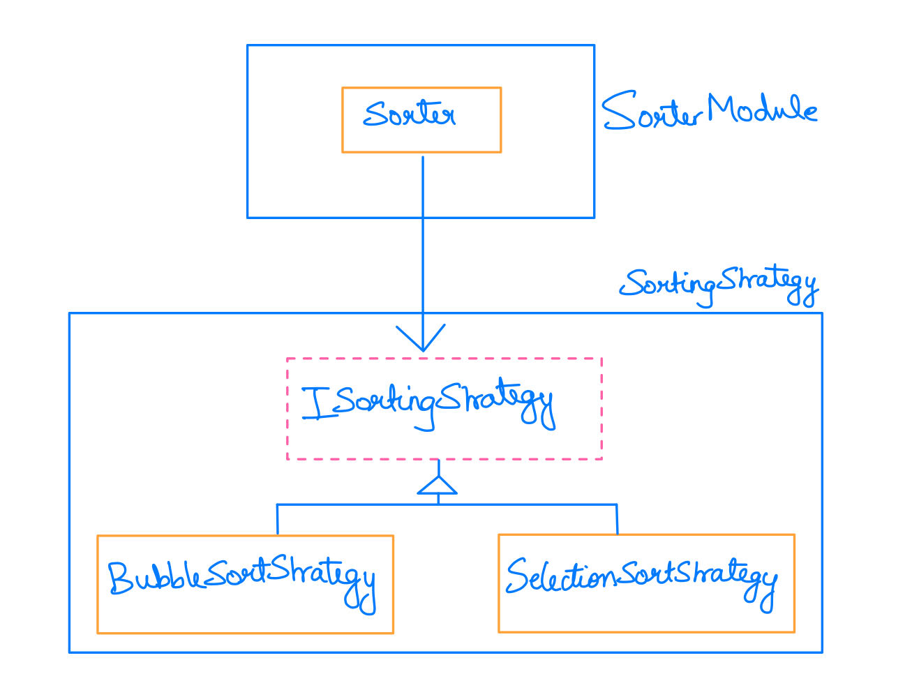

# Strategy Design Pattern

## Overview
The **Strategy design pattern** is a behavioral pattern that enables an algorithm's behavior to be selected at runtime by defining a family of algorithms, encapsulating each one as a separate strategy, and making them interchangeable. This also makes it easy to add new strategies without modifying existing code. It is particularly useful when you have multiple ways to perform a specific task. This repository provides an example of Sorting using the Strategy Design Pattern

The **Real World Application** for the Strategy design principle includes
- In e-commerce applications, the strategy pattern can be used to change payment methods like credit cards, PayPal, or mobile wallets.
- In GPS applications, this can be used to provide the user with different routes based on the mode of travel (car, bike, public transport, or by foot)

##  Design
This project implements a Sorter Class. The Sorter class has a method which sorts an array of numbers. But the Sorter method does not tell which algorithm (or strategy) to be used when sorting. According to the use case, the sorting algorithm (or strategy) can be dynamically changed by changing the class member of Sorter Class, thus demonstrating Strategy Design Principle. This avoid code duplication. An example use case is, when array size is small, bubble sort or insertion sort performs better than merge sort due to their lower overhead. Hence, the strategy to sort can be dynamically changed during runtime based on the array size.

## Environment
The project builds and runs with Visual Studio Community 2022 when the required workloads are installed.
